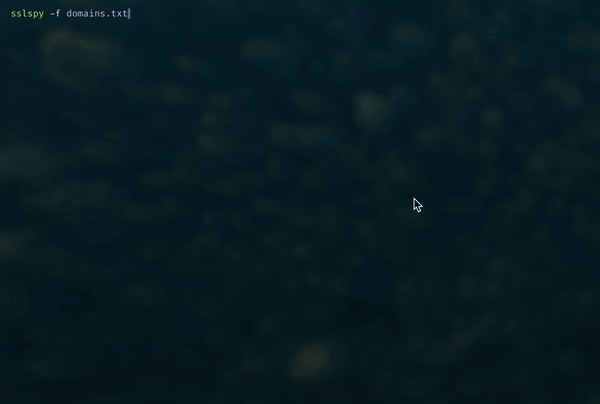

# SSLSpy

A comprehensive SSL/TLS security scanner for analyzing certificates, protocols, and security vulnerabilities.

## Demo



## Features

- SSL/TLS certificate expiration checking
- (Coming soon) Protocol version detection (TLS 1.0, 1.1, 1.2, 1.3)
- (Coming soon) Cipher suite analysis
- (Coming soon) Certificate chain validation
- (Coming soon) Security vulnerability detection
- Beautiful terminal UI with real-time updates
- Configurable warning thresholds
- Concurrent processing for faster scanning
- Detailed JSON output for further analysis

## Installation

```bash
pip install sslspy
```

## Usage

### Basic Command Line Usage

Check domains listed in a file:

```bash
sslspy -f domains.txt
```

### All Options

```shell
sslspy -f domains.txt -o results.json -t 10 -w 60 -j 5
```

Options:

- `-f, --file FILE` - File containing domains to check (one per line) [required]
- `-o, --output FILE` - Output JSON file for results (default: sslspy_results.json)
- `-t, --timeout SEC` - Connection timeout in seconds (default: 5)
- `-w, --warning-days DAYS` - Days before expiry to trigger warning status (default: 30)
- `-j, --workers NUM` - Maximum number of concurrent workers (default: 10)
- `--no-fancy-ui` - Disable the fancy terminal UI
- `-h, --help` - Show help message and exit

### Domain File Format

Create a text file with one domain per line:

```shell
example.com
google.com
github.com
# Lines starting with # are ignored
```

### Python API

You can also use SSLSpy programmatically:

```python
from sslspy import check_domains

# Check multiple domains
results = check_domains(
    domains=['example.com', 'google.com'],
    timeout=5,
    warning_threshold=30
)

# Process results
for result in results:
    print(f"Domain: {result['domain']}")
    print(f"Status: {result['status']}")
    print(f"Days left: {result['days_left']}")
    print(f"Expiry date: {result['expiry_date']}")
    if result['error_msg']:
        print(f"Error: {result['error_msg']}")
    print("---")
```

## Output

SSLSpy provides:

1. A real-time terminal UI showing progress and results
2. A final summary once all checks are complete
3. A detailed JSON output file with all results

## License

MIT

## Contributing

Contributions are welcome! Please feel free to submit a Pull Request.
